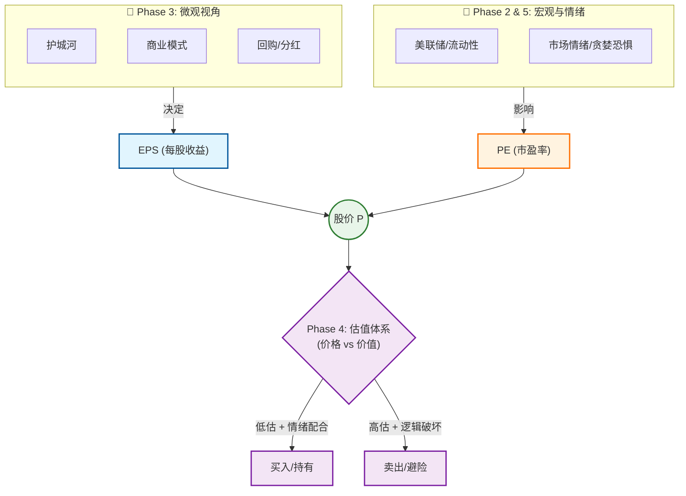

---
tags:
  - index
  - hub
aliases:
  - Dashboard
  - 投资体系
---

# 个人投资体系 Dashboard

> [!tip] **Phase 1: 投资第一性原理**
> $$ \text{股价 (P)} = \text{每股收益 (EPS)} \times \text{市盈率 (PE)} $$
> [[Investment_First_Principles|👉 深入理解核心公式]]

## 🔗 股价涨跌的逻辑链条 (Logic Chain)

## 🛠️ 体系模块导航

### 🏎️ 核心驱动力 (Drivers)

*   **分子 ($EPS$)** (Phase 3: 微观)
    *   **[[Business_Quality_Moats|商业模式与护城河]]**: 好生意、护城河
    *   **[[Financial_Health_Returns|财务与股东回报]]**: 回购 > 分红
*   **分母 ($PE$)** (Phase 2: 宏观)
    *   **[[Fed_and_Liquidity|宏观视角：美联储]]**: 全球资产定价之锚
*   **特殊资产 (Gold)** (Phase 2: 宏观)
    *   **[[Gold_Logic|黄金与货币]]**: 避险、抗通胀

### ⚖️ 决策与风控 (Execution)

*   **裁判 (Judge)** (Phase 4: 估值)
    *   **[[Valuation_Framework|估值体系]]**: 相对估值、DCF、安全边际
*   **执行 (Action)** (Phase 5: 心法)
    *   **[[Mindset_Risk_Control|交易心法与风控]]**: 凯利公式、情绪管理、止盈止损

---
*🔥 常用速查*:  [[Davis_Cycle|戴维斯双击]] | [[Ten_Year_Treasury|10年期美债]] | [[Buyback_vs_Dividend|回购 vs 分红]] | [[Earnings_Surprise_Logic|预期差博弈]]

## ✅ 投资决策 CheckList

> [!check] **Step 1: 初筛 (Screening) - 值得看吗？**
> - [ ] **护城河**: 是否拥有网络效应、转换成本或无形资产？([[Moat_Types]])
> - [ ] **成长性**: 营收/利润增长是否稳健？(SaaS 参考 [[Tech_Metrics|Rule of 40]])
> - [ ] **股东回报**: Shareholder Yield (分红+回购) 是否 > 3-5%？([[Buyback_vs_Dividend]])

> [!check] **Step 2: 宏观确认 (Macro Check) - 现在能买吗？**
> - [ ] **Fed 态度**: 当前处于加息、降息还是观望周期？([[Fed_Mechanics]])
> - [ ] **流动性**: 10年期美债收益率是否处于高位/飙升中？([[Ten_Year_Treasury]])
> - [ ] **市场情绪**: VIX 是否极度贪婪 (>20) 或极度恐慌 (>30 可能是机会)？([[Market_Sentiment]])

> [!check] **Step 3: 估值核算 (Valuation) - 便宜吗？**
> - [ ] **相对估值**: Forward PE 是否低于历史 5 年均值？PEG 是否 < 1.5？([[Relative_Valuation]])
> - [ ] **绝对估值**: 反向 DCF 隐含的增长率是否合理？([[DCF_Logic]])
> - [ ] **位置**: 股价是否处于 5 年 PE Band 的下轨？([[PE_Band]])

> [!failure] **Step 4: 风险排查 (Red Flags) - 有雷吗？**
> - [ ] **SBC 陷阱**: Stock-Based Compensation 是否过高导致回购失效？([[SBC_Trap]])
> - [ ] **内幕交易**: 管理层近期是否有大额抛售？
> - [ ] **竞争恶化**: 是否有新玩家破坏了护城河？

> [!example] **Step 5: 交易计划 (Action) - 怎么做？**
> - [ ] **仓位控制**: 基于凯利公式，这笔交易占总仓位多少？([[Position_Sizing]])
> - [ ] **分批建仓**: 计划分几次买入？(如：50% -> 30% -> 20%)
> - [ ] **止损位**: 硬止损点在哪里？(如：-8% 或 200日线) ([[Stop_Loss_Strategy|止损与退出策略]])

## 🚀 Strategy & Action
[[2026_Investment_Plan|👉 进入年度作战室 (示例)]]

## 🧭 工作区入口 (Working Hubs)
- [[us-stocks/Home|🇺🇸 US Stocks Hub]]
- [[polymarket/Home|🎯 Polymarket Hub]]
