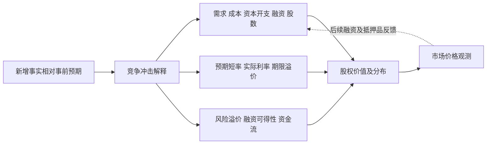

---
tags:
  - methods
  - macro
aliases:
  - Macro Inference Contract
  - 宏观推导合同
---

> [!info] 方法规格镜像
> 原文住私有仓 `agents/methods/`，是 AI 研究角色共用的方法规格。宏观 / 基本面结论在本系统**零交易授权**：只作方向先验与风险环境，不产生买卖、仓位或退出规则。

# 宏观推导运行合同

2026-09-05重建。`tasks/intelligence/radar.md` §5与事件流程以本合同为方法真源；旧相位设计是历史参考。目标是识别**能改变组合现金流或风险的增量信息，评估已计价程度与剩余风险**；无法识别已计价程度时明确未知，重要但已计价的背景仍可保留。以下是研究合同，不是已校准的收益预测模型。

## 1. 先回答五件事

1. **现状**：增长、通胀、就业各是什么水平、趋势和内部结构？不要用一张月报宣布经济换挡。
2. **增量**：本次发布相对事前共识、市场隐含路径、上次判断各改变了什么？这三个基准分别记录，不能互换。
3. **冲击**：增长、供给/通胀、货币政策、财政久期、融资或风险偏好，哪种解释更有证据？至少保留一个可区分的竞争解释。
4. **传导**：影响的是公司的收入、利润率、营运资本、资本开支、再融资、股数，还是股权折现率？影响何时兑现、哪些事实会截断传导？
5. **剩余风险**：价格已吸收多少、哪些共因子集中在持仓中、最可能推翻当前判断的观测是什么？无法量化就明确未知。

数据好坏、股票方向、判断置信度、事件概率、尾部损失是不同对象。`high` 是证据可靠程度，不是 80% 胜率；风险分不是收益率、概率、仓位或 ERP 参数。

## 2. 因果结构：并行渠道，有共同原因

政策不必是每个冲击的中间环节。出口管制可直接改变可服务市场；电力短缺可直接推迟交付；财政供给可抬高长端而短端下行。机制顺序不等于分钟级价格先后：信用与股权可同时反应，现金流预期也可即时变动。

价格只能验证市场反应，不单独识别 EPS 或 ERP。不得“股票涨 → EPS 强 → EPS 强解释股票涨”。金融条件指数若已包含股票、信用、美元，也不能再与这些组成项独立投票。

### 2A. 美债是重要基准，也是被解释的价格

“所有资产都是收益率的产物”不能作为因果起点：现金收益率、债券到期收益率、事前要求回报和
事后总回报不是同一个量。对有现金流的资产，价值取决于现金流、兑现时间和风险调整后的折现；
风险补偿还取决于坏状态中的损失与流动性，不只是历史波动率。美元美债曲线是重要基准，
但需匹配币种、期限、名义/实际口径；2Y/10Y/30Y是曲线观测点，不能各自机械绑定一个资产类别。
美元以外现金流要处理当地曲线、汇率和对冲成本。黄金、商品和BTC不能套同一EPS或票息模型：
实际利率/美元影响机会成本，同时存在供需、库存、服务/便利收益或采用等不同机制。
跨资产观测不增加交易市场。

美债也不意味着没有风险：固定名义支付的信用基准不消除久期价格风险、通胀购买力风险和
融资/抵押品流动性风险。投资者会受负债久期、抵押品需求、监管和赎回约束，并非只挑最高收益率。

收益率有两种常用观察视角，**不能将它们的所有项相加**：

- 名义收益率约等于未来名义短率预期的期限平均 + 期限溢价；具体模型还会吸收不同的流动性/供需因素。
- 同期限名义收益率约等于TIPS实际收益率 + 盈亏平衡通胀补偿；通胀补偿含风险和流动性溢价，
  TIPS实际收益率也不是纯预期实际短率。必须对齐期限、曲线/债券定义和观测时钟。

`10Y−2Y`是斜率，不是期限溢价；期限溢价只能标模型估计。若模型已经吸收流动性/供需效应，
不能再把同一效果作为额外bp加一次。纽约联储ACM覆盖1–10年，不能把10Y估计当成30Y分解。
未取得可核估计时明确未识别。[纽约联储收益率解释](https://www.newyorkfed.org/newsevents/speeches/2023/per231116)、
[联储TIPS研究](https://www.federalreserve.gov/econres/feds/the-tips-yield-curve-and-inflation-compensation.htm)、
[ACM范围](https://www.newyorkfed.org/research/data_indicators/term-premia-tabs)。

### 2B. 先判断什么推动收益率，再判断收益率传向哪里

| 原因候选 | 利率渠道与区分证据 | 同时存在的直接渠道与反馈 |
|---|---|---|
| 需求/生产率变化 | 增长、就业、收入和事前预期改变短率路径及长期实际回报预期 | 收入/盈利可直接变化；利率上行与股票上涨可以共因，不能解释为高利率使盈利变强 |
| 通胀/供给冲击 | 分项价格、工资/生产率、能源供给、政策路径、通胀补偿 | 成本与需求受损可能先于政策动作；不同期限利率方向未必一致 |
| 政策意外或反应函数改变 | 以会议前路径为基准，区分政策冲击与央行透露的增长信息 | 折现、风险承担、融资与现金流预期并行；降息若源于衰退不必利好股票 |
| 财政与久期供给 | 净发行期限、拍卖/结算、QE/QT、可得期限溢价模型、持有需求 | 财政需求刺激与长债供给分开；2Y下降但30Y上升不矛盾 |
| 避险、抵押品需求、去杠杆 | 美债深度/融资、美元、信用、期限与实际头寸证据 | 避险通常增加国债需求，但筹现金/保证金压力也可能造成股债同卖；不能由股债同跌单独确认强平 |

2Y通常更贴近未来数年的政策路径，但不是纯政策预期；10Y兼有中长期路径和期限补偿；
30Y更需核对长久期供需与通胀/财政不确定性，不能把这种经验侧重写成排他归因。
每个期限保留自身来源窗口。曲线变陡先区分短端降得更快、长端涨得更快或异向扭转。

收益率变化的后果包括旧债价格变化、再融资成本、抵押贷款/资本开支门槛、汇率相对回报、
股权折现及抵押品价值；其中一些又反馈到消费、投资、盈利、风险预算和后续政策预期。
同一时段共同响应不证明“债先动、股后动”。链条必须写竞争解释和下一判别证据。
市场仓位与定价模块见 [[market-structure-analysis]]；它既可放大宏观冲击，也可能自行触发价格变化。

### 2C. 再往上游：不要用一个市场价格解释另一个就停止

“油价冲击”“日元冲击”“利率冲击”只定位了发生变化的价格，还没有识别起因。沿每条
causal_hypothesis继续追问：什么可核事件、数量、政策信息或融资约束发生了变化；相对哪个
事前基准构成意外；价格是这个变化的结果、下游传导变量，还是通过资产负债表反馈形成的新冲击？
在shock中写清原始驱动与来源，rate/cash_flow/risk_premium_channel写传导，feedback单列放大。
同一变量的角色随问题和时间窗变化，不能永久贴成“因”或“果”。

追溯到当前信息集里最早可核的变化即可；更早的原因缺证据就写未识别，不为追求完整故事无限
倒推。价格先动可能是在交易未来供给预期，并不要求实际产量已下降；事后发布的数据不能解释
更早的行情。数据发布是信息冲击，数据所描述的经济变化可能早已发生，两者时钟分开。

- 油价：区分产量/运输中断、全球终端需求、预防性库存需求及风险/仓位重估。同样油价上涨，
  供给减少可能挤压实际收入，需求扩张则可能伴随收入增加。油价随后又进入成本、通胀、政策
  预期和现金流。不能由油涨单独断言需求强、通胀持续或长债必跌。
  [联储油价冲击分解](https://www.federalreserve.gov/econres/notes/feds-notes/second-round-effects-of-oil-prices-on-inflation-in-the-advanced-foreign-economies-20231215.html)。
- USDJPY：先查美日各自政策路径/经济信息、其他日元交叉盘、干预事实与预期、实际流量与空头
  回补证据。美国利率下降、日本利率预期上升、外汇干预和融资去杠杆可以产生相似现货方向。
  不能把美日两个10Y收益率相减就当套息回报或完整的汇率模型。
- 日元升值的反馈：对未对冲的日元融资美元资产，美元资产换回的日元减少，负债偿付与保证金
  压力可能引发卖资产/买日元，进一步推升日元。这是条件链，依赖真实杠杆、对冲、融资期限和
  触发约束；日元融资者不一定是日本投资者，平仓也不一定经过卖出美股。
- 日本居民回流与外汇对冲：分开卖海外资产换日元、仅提高外汇套保、投机空头止损和官方操作。
  增加日元远期对冲可以保留海外资产。比较套保后美元资产回报与本地资产，考虑期限和basis；
  日本短率上升也可能降低美元资产的套保成本，不能机械推出海外债券必被抛售。
- 油价与日元的交互：美元油价与USDJPY共同决定日元计价进口油成本的机械部分，近似为二者
  的乘积（忽略运费/税费/套保）。油涨与日元升值可以相互抵消部分进口成本；贸易条件、两国
  政策反应和融资反馈可能给汇率相反方向的压力，不能指定单向箭头。

上游识别按观测、候选驱动、竞争解释、受约束的参与者、反馈触发、区分证据和缺口交付。
“日元升值已观测”与“系统性套息去杠杆已确认”必须分开；后者需要同步波动/融资、实际敞口或
流量以及受影响资产的证据，旧OAS、储备存量下降或单一阈值不充分。参见观测地图§3。

### 2D. 运行顺序与停止条件

先从当前信息集列事实和时间，再保留至多三个竞争机制。对每条写出事前预期、初始变化、
价格反应、受约束的参与者和反馈触发，最后才给资产条件影响。逐条问：去掉这份价格证据，
上游解释还成立吗；如果同样价格由另一机制驱动，下游结论会不会变？这用于找循环归因和
不充分识别，不是已有计量因果检验。工资/产出、政策反应和资产价格可以相互反馈，不追求
一个能永久解释所有市场的根变量。

同向利率变动允许不同现金流结果；同一宏观消息允许因已计价、仓位或流动性而出现相反反应。
当竞争解释未能区分，保留并列或unknown，不按指标多数票选择，也不把置信度换成概率。
时间或原始证据不足时停止归因、明确待取得的判别信息；不以无限扩展传导链替代证据。

worker结果1.3.0将上游、事前基准时钟、价格角色/窗口、参与者/约束/触发和条件资产渠道
结构化；字段规则见 `agents/macro.md`，强制点在 `quant/core/macro_analysis.py`。
宿主生成的 `macro_market_context` 是证据整理收据，不能把它的计算身份当作机制已确认。
它拒绝拼接异源、异单位、同时间修订和未来快照；两点差不识别分钟反应、净流量或已计价比例。
宏观工作流的初始研究与追问分开归档，追问的新情景不会重写已经完成的下游计算。

### 2E. 事件推演：数据结构 → 政策选择与沟通 → 市场接受度 → 后续反馈

2026-09-11，吸收 用户 提供的 CPI/FOMC 推演思路。目标是让读者知道哪一条路径正在成立、
下一项观测会如何改变判断。以下是条件研究方法，不是本次会议预测或新增交易规则。

**先写矛盾与主判断。** 用一小段说明政策面临什么取舍、市场事前押注什么、主要风险在何处。
有依据就明确主假设及理由；缺证据时列出最需要区分的两条路径，不用“多空交织”结束。
把“我认为最有利的政策”“我预测央行会做什么”“市场已计价什么”分开；政策最优性需要说明
评价目标、增长/就业代价和竞争选择，不能把研究者偏好当作央行反应函数。

**数据先按内部结构分类。** CPI 示例须区分核心月率、总项与能源、shelter、住房外核心服务、
median/trimmed mean、价格扩散，以及关税/能源等是否向更广篮子传导；核对各指标的定义、
季调、数据期和发布时间。单一波动分项贡献不能替代持续性判断。“super-cool”之类标签必须
事前给联合条件；关键分项或后发布指标缺失，写“总量已知，广度待确认”，不默认通过。
低核心通胀还须与就业、需求和信用背景交叉：良性去通胀与衰退式降温不能共用同一个风险资产结论。
示例阈值不是经济定律；实际值、调查共识、分项模型预估与研究假设分别注明来源和时点。

**数据分支内再展开政策回应。** 数据结果与政策动作是两层条件，不能写成“某个 print 必然加息”。
相关会议至少比较 hold、一次调整且后续有条件、持续调整路径；方向按当时政策问题决定，
不能预设每次都是加息。逐项拆开本次目标利率、SEP/点阵图的条件路径、声明和发布会的反应函数。
反应函数要回答：哪些观测、怎样的持续性/扩散、何种就业与信用代价会改变下一次选择；
央行没有给可核门槛时明确未知，不代其编数值，也不把点阵图当作承诺。
CPI 与 FOMC 分别保留事前基准和反应窗口：CPI 后的新定价可成为 FOMC 的事前基准，
但不能覆盖 CPI 前已冻结的预期；后一次会议仍未发生时不写成已观测的后续反应。

**“第一根”和“第二根”写成可验证的两个阶段。** 每条重点路径说明：

1. 新信息相对事前定价的差异；前端路径、2Y、美元、股权的初始条件反应。
2. 后续何时检查政策解释是否被接受：前端是否延续或反转，10Y/30Y、实际利率、通胀补偿、
   可得期限溢价估计与信用怎样配合。预先给事件即时、发布会后、收盘或后续交易日窗口；
   缺分钟数据不能用日变化代替“冲高回落”，滞后OAS只能等待更新。
3. 哪类参与者可能受损或被迫调仓，约束是什么；随后融资、投资、就业、盈利在什么期限兑现。
   初始利率下行不等于已经出现衰退保护，初始股价反弹也不等于信用传导已经改善。

第二阶段与第一阶段相反是一项待检验预测，不是“先跌后涨”的固定脚本。仓位回补与新增配置
分开；“record SOFR 空头”须有合约、投资者类别、gross/net、历史比较窗和观测日期，
还须考虑对冲头寸，不能由空头存量直接推出被迫回补规模。所谓 pain trade 写清谁的什么押注
会受损、什么触发约束；QQQ/SOXX/EM上涨不独立证明资金从现金搬入。

**信誉风险和过度紧缩是竞争假设。** hold 后长端上行，可能符合通胀锚松动，也可能来自财政
供给、增长或流动性变化；仅凭2Y下、10Y上不能确认 credibility risk。给出对齐窗口的通胀
补偿/预期、政策路径及供需区分证据。hold 后通胀预期仍稳定且信用未恶化，是需要保留的反证。
一次加息也不能直接标为“重新锚定成功”：市场可能接受条件性暂停，也可能把动作或点阵图
解读为更高终点、更久限制或央行透露更坏的通胀信息。分别说明支持和推翻这些解释的观测。
长端稳定与信用稳定可以支持风险缓解，仍不单独证明某次加息是损害最小的选择。

**研究线位必须带出处与寿命。** 用户范例的核心月率0.20%/0.23%/0.30%、10Y的4.65%/
4.826%、HY OAS的325bp及分项预估，均是待核实的示例输入，不是本合同认可的当前事实或常数。
使用任何线位需注明品种、单位、来源、观察期、选择理由与复核窗口，并结合变化幅度和持续性。
单一线位突破不充分证明利率机制切换；不得拿旧OAS为新事件背书。三段示例还须按§7补齐
区间空隙、分项冲突、增长恶化、缺失数据和政策意外，不能只保留最顺畅的三个故事。

**落实形状（2026-09-11 接线）。** 本节的思路有了代码形状：`quant/core/macro_playbook.py` 事件剧本 =
一句话判断 → 矛盾 → 三条路径（已计价／我预测／我认为损害最小）→ 冻结基准 → 联合条件 → 情景
（结果条件 → 政策回应比较 → 第一根 → 第二根 → 谁受伤 → 滑向）→ 判别线位（带出处与复核日）→ 剩余分支。
代码只查形状：分支互斥穷尽、第二根不是第一根镜像、正文数字必须有线位、flip 指向另一分支；不校准概率、
不判断内容对错。`quant/report/macro_playbook_report.py` 渲染成固定版式并编译为 plan 的 `scenarios`；
`macro_state.py` 拒绝不是从剧本编译出的 `pre_event`。版式真源 `macro-reader-format.md`；事件流程
`tasks/intelligence/macro-event.md` §3–4。

worker 侧不变：`upstream.baseline/surprise` 保留数据及政策定价基准，`rate_channel/cash_flow_channel/
risk_premium_channel` 写政策条件与不同阶段传导，`feedback` 写参与者与约束，`confirmation/invalidation/
next_observation/due_at` 写市场接受度判别。`market_responses` 只记录已有观测，未来反应写条件推演；
最多三条因果假设不等于完整事件树。本节不改变任何交易授权。

## 3. 核心机制候选组

按机制组织，不按 ticker 数量计分。每轮检查各组是否有实质变化，稳定低频事实引用原版本；只展开与结论有关的组。以下是候选覆盖框架，不声称已经证明最小充分或最优；建设优先级和信息增量检验见 [[macro-sensor-map]] §7–9，不是模型权重。

| 因子组 | 核心观测 | 正确用途与缺失处理 |
|---|---|---|
| 实体增长与就业 | 实际消费/收入、实际最终需求、订单、就业3个月趋势与修订、工时、参与率、初请/续请、扩散 | 分开水平与斜率；就业数量强不保证私人需求或未来盈利强。GDP总量要分库存/净出口，软调查与硬数据分开 |
| 通胀与供给 | 核心CPI/PCE月率与3/6个月趋势、分项扩散、工资相对生产率、能源/运输/关税传导 | 同比基数效应不等于新去通胀；一次油价上行不证明需求强；区分需求拉动与成本冲击 |
| 政策与利率路径 | 目标区间、沟通、按会议日期的期货/OIS路径，2Y/10Y/30Y、实际利率、通胀补偿 | 2Y与Fed futures属共享政策机制，不能当两份独立证明；媒体转述隐含概率保留日期、合约与来源限制 |
| 财政与融资条件 | 净发行及久期/结算日、拍卖、期限溢价估计；HY/IG OAS、贷款标准、发行/再融资条件 | 久期供给与财政刺激不是同一个方向；期限溢价是模型估计；公司债成本=匹配期限无风险利率+利差+费用 |
| 流动性与脆弱性 | TGA/RRP/准备金/Fed资产，以及SOFR-IORB、EFFR-IORB、回购分布/官方工具使用；杠杆/融资期限 | 资产负债表存量解释背景，资金价格与市场功能判断压力。`Fed资产−TGA−RRP`不是股票购买力。报告目前未接入的利差/工具为缺口，不伪称已监测 |
| 市场传导与风险偏好 | 同窗曲线、信用、美元、波动期限结构、真正股票广度；按需油/金/BTC/海外政策/汇率 | QQQ、SMH、SOXX回报属股权反应，不能称成分股广度。金/BTC不是每轮必经裁判；低VIX不排除高杠杆/跳空风险 |

全球变量按曝险触发：日本政策/日元融资、海外美元融资压力、中国终端需求、出口管制、台湾/韩国供应链、能源及航运。不要为“全面”每日罗列所有国家，也不要因公司不在交易名单就禁用其作为上下游证据。

纽约联储将期限溢价作为不可直接观察的估计对象，不能把长端升幅全部解释成它。[期限溢价方法](https://www.newyorkfed.org/research/data_indicators/term-premia-tabs)

资金市场应同时监测利率相对管理利率的偏离与分布；单一资产负债表总量不充分。[准备金与回购压力监测](https://www.newyorkfed.org/newsevents/speeches/2024/per240926)

### 3A. 跨资产与跨类别综合

宏观观测范围独立于交易名单：USDJPY是常设跨境融资观察，WMT等企业的经营数据是消费/工业/融资背景的观测点。具体选择、代表性、频率和竞争解释见 [[macro-sensor-map]]；不要求日常全量检索所有示例公司。

观测先绑定待判断期限、竞争解释与实际曝险，再选择来源。常设维护事前基准、经济状态、金融传导、AI兑现与资金来源、暴露与脆弱性五份底稿；按发布和异常展开调查，并保留简短盲点检查。预期、会计口径、兑现阶段和损失放大条件是贯穿各组的分析维度，不再各自叠一票。数据字段齐全率只说明采集状态，不能替代机制覆盖或研究质量。

公司特有的EPS或股价不能直接计为宏观利多，但具有代表性的客流、客单、品类、货量、信贷和资本开支数据，可以在剔除份额、价格、地区和公司执行等混淆后参与宏观状态判断。官方总量、企业经营、市场定价与融资风险共同使用；来源跨类别仍可能测量同一对象，不能简单按条数投票。

新增新闻窗口不限制有效知识窗口：最新月报、季度财报和政策背景可以在后续轮次继续使用，保留观察期与发布日期，只更新实质变化。季度同比与月度环比先匹配口径；有效的慢背景不冒充即时确认。允许消费有韧性与跨境资金压力上升同时成立，不把二者平均成中性。

## 4. 证据时间与血缘

每条决定结论的证据只表达一个可定位事实，至少在来源归档中保留：`evidence_id / event_id / origin / url / locator / observed_at或observation_period / released_at / retrieved_at / unit / source_version或content_hash / role / family`。`role` 分为背景、预期、事件事实、市场反应、竞争解释证据。保留最小事实定位或文件摘要即可，不要求复制整篇付费文章。

其中origin、定位和实际获取时点须可复核；其余按适用性记录，不适用或不可得用null并标精度/限制。慢变量可能只有月份，政策文本可能无单位、独立event_id或精确发布时间，不为填表补造。现有结构化source.as_of须使用真实可验证的来源可见时点，并说明它是公布还是获取；市场观测as_of只能用真实报价时刻，不能拿获取时间补齐。

- **数据期、公布时刻、获取时刻分开**。周频准备金可以是最新有效背景，但不是刚公布非农后的流动性反应。最新月度CPI不是因距今数周就失去宏观价值。
- 同一新闻稿的媒体转载、同一数据的同比/月比/三月均值、同一次政策冲击的多个资产回报，各自保留用途，不能作为独立似然连乘。schema的“两个桶”只是最低分类检查，不是统计独立性证明。
- 混合日频OAS与实时HYG必须拆为两条证据。一个合成段落只挂最新时间会洗新旧数据。
- 事后反应需要**事件前基准与事后观测**，同品种、单位、交易时段；仅有较昨收变化，记录日变化，事件归因仍未识别。已发生另一场数据发布/政策讲话时标记混杂。
- 事件前的OAS不扩大只能说明此前背景，不能反驳事件后信用压力。缺数据是 pending，不是“没有压力”。债券ETF价格平稳也可能是利率收益与利差损失抵消。
- 原始来源取不到时保留限制。来源类型、正文定位、时点不因模型确信而升级；可读性/格式通过不证明事实正确。

BLS月度就业受抽样差异和后续修订影响；趋势判断要保留当时数据版本，不能把最新修订值倒灌进历史预测。[BLS方法与测量指南](https://www.bls.gov/bls/empsitquickguide.htm)

## 5. 状态、冲击与反应分开

先描述经济状态向量，再描述本轮冲击，最后列市场反应。`policy_tightening` 是政策/定价维度，`growth_scare` 是增长担忧，`credit_stress` 是传导压力，可以并存；现有单一 `regime` 仅作主要解释标签，不能强迫它们互斥。

每个主判断至少写清：假设ID、证据、竞争解释、可区分的下一观测、截止时间、当前识别限制。没有期限溢价或实际利率分解时，允许“长端上行、驱动尚未识别”。

| 组合 | 候选解释 | 区分观测；均非机械交易规则 |
|---|---|---|
| 利率下降、股票上涨 | 良性去通胀/政策缓和 | 增长与信用是否稳定；是否只是已计价事件后的平仓 |
| 利率下降、股票下跌 | 增长担忧/现金流下修/去杠杆 | 信用与融资、就业和盈利修订；降息本身不保证利好 |
| 利率上涨、股票上涨 | 增长预期或特定盈利改善 | 新盈利证据、实际/名义分解；涨价本身不能证明EPS上修 |
| 利率上涨、股票下跌 | 政策/通胀/财政久期/风险溢价冲击 | 短端路径、长端、通胀补偿、信用与供给证据区分 |

Fed相关冲击包含政策动作、反应函数变化及信息等来源，并经收益率、风险溢价与现金流预期等渠道作用，不能一律看作折现率冲击。[联储研究综述](https://www.federalreserve.gov/econres/feds/the-effect-of-the-federal-reserve-on-the-stock-market-magnitudes-channels-and-shocks.htm)

## 6. 风险结论与三个时间窗

`supportive / neutral / adverse / crisis` 表示有证据的净环境判断；新增 `mixed` 表示关键渠道冲突、无法可靠相抵；`unknown` 表示证据不足。后两者 `score=null`，未知置信度低。**未确认全面收紧 ≠ 中性；无危机 ≠ 支持性。** 分数 -2..+2 只表达方向及程度，不能把信用压力与单日上涨算术抵消。

同时用文字保留路径分歧、脆弱性与事件风险，尤其是宏观均值平稳但尾部损失集中的情况。Fed金融稳定框架也区分冲击和使系统受冲击时更脆弱的结构。[金融稳定监测框架](https://www.federalreserve.gov/publications/2022-may-financial-stability-report-framework.htm)

- `event_window`：具体事件前后，记录市场时钟；休市、异步行情、其他消息可能使反应不可识别。
- `short_1_10d`：定价是否持续、扩散或反转；用绝对到期日及交易日窗口，不能每天把期限向后滚以逃避证伪。
- `medium_1_3m`：经济趋势、客户预算、融资与盈利；不能凭事件窗口的价格联动确认为中期经济相位。

三个期限独立举证，不把同一句“等2Y/美元/OAS”复制三遍。无新信息可引用旧判断的时间与到期；证据薄弱就未知，不补故事。事件概率与方向置信度不跨期限搬运。

## 7. 情景树：先分事件结果，再检验市场路径

事前冻结事件时间、指标/口径/前值/共识及来源时点、已计价路径、情景条件、概率依据、反应窗。没有共识时，只能与前值/明确研究基准比较，不称超预期。

**事件结果分类**应互斥且穷尽；实际值决定分支，事后价格决定该分支的传导预测是否成功，不能用“股票必须涨”定义冷通胀事件发生。多指标冲突用二级分支或显式剩余分支。数值分支写成同一指标上的 `[lower, upper)`（含下不含上，首尾开区间），由 `quant/core/macro_playbook.py` 检查互斥穷尽与边界归属；事后落分支只看这个边界（`branch_for`），不选「最接近」。

设计示例（仅示范集合划分，不是CPI预测或已校准阈值）：先用核心月率 `x≤0.1 / 0.1<x<0.4 / x≥0.4` 全覆盖，再在每个分支区分能源、增长/信用背景。不能只列“核心0.2–0.3且总项≤0.3”，却没有处理总项0.4的分支。至少用边界值、相邻值、数据互相冲突值、缺失/修订值检查覆盖；核心冷且增长恶化必须能落入衰退式缓和路径。

概率是可选研究产物：

- 能解释依据才给区间，并标为调查/市场隐含/历史频率/研究者判断；研究者区间未经校准要明确，不能冒充模型后验。
- 没有足够依据：所有分支 `probability_range=null`，`probability_basis` 写缺口，报告只给条件推演。不得为满足schema编40–50%。
- 区间只说明可行包络；`sum(min)≤100≤sum(max)`不保证条件覆盖、互斥、统计校准。中点不必恰好100，但不能直接用不归一的中点计算EV；EV需要明确完整概率向量与收益分布。
- 第二、三阶影响没有证据时数组可空，不强写确定方向。`timing`区分立即定价与数季后现金流兑现。

事后保留整个事前树，实际结果落不到树内时 `selected_scenario_id=null, scenario_match=outside_tree`，说明缺失分支，不“选最接近”掩盖错误。实际数据仍不足以分类时用null加 `scenario_match=pending`，事件保留released/awaiting_market_confirmation，不能closed；缺数据与树外是不同问题。保留首次结果，后续固定轮按event_id继续复核收盘/后续交易日/宏观数据，标完成、失败、混杂或未观测；不改immutable result以改善战绩。

**确认/证伪必须针对同一个命题。** 每个horizon的thesis先声明“当前检验：<候选或当前标签>”。逐字复核两组条件的方向、单位、阈值与窗口；确认和证伪不可互换。同一条件同时命中时先报告模型冲突。JSON结构校验不能替代此语义复核。

## 8. 公司与组合传导

从财务暴露表复用稳定信息，只对本轮冲击做增量分析。不能用新闻条数或市值加权平均替代真实组合风险。

| 渠道 | 必答问题 |
|---|---|
| 收入/订单 | 是最终付费需求还是供应商之间的融资/预付款循环？合同是否可取消、执行期多长、确认收入条件是什么？是否已在指引/RPO中？ |
| 利润与现金流 | 价格、数量、成本、折旧、营运资本、capex各如何变化？订单额/融资额不等于净利润或FCF |
| 融资与股数 | 现金是否受限、浮息比例、到期墙、资本开支缺口、抵押条件/转股稀释？固定票息不会因市场利率变化自动重定价 |
| 折现率 | 现金流币种/期限匹配；无风险率、期限补偿、ERP、债务利差不要重复计量。同一损失已进现金流后，不再无依据再打同额估值折扣 |
| AI单位经济 | 推理单价下降如何改变付费需求、利用率、训练/推理结构、GPU小时、效率与竞争？效率提高既可能扩量也可能降低单位算力需求，弹性未知则不预设受益 |
| 组合共同暴露 | 多只票是否共用同一客户预算、电力/交付瓶颈、融资来源、久期或美元因子？期权另看delta/vega/期限/跳空，去重后的ticker名单只用于新闻覆盖 |

正盈利且EPS口径一致时，`P=EPS×PE` 是分解恒等式，不能独立识别价格因果。负EPS、接近零EPS或跨零时不使用对数EPS/PE；用正常化现金流与股权价值桥：企业价值 + 可分配现金 − 债务及其他索取权，再处理完全稀释股数。AI资本密集业务必须同时检查回报率与融资可得性。

单季度/本财年指引不得直接写多年增长参数。当前引擎 `growth_start` 作用于第2年及其后衰减路径；`revenue_base` 改收入基数。若新事实不匹配现有驱动时间范围，先只写报告；不要找“最接近”的字段填进去。

## 9. 交付与校准

主报告保留：当前判断及相对上轮变化、两三项主驱动、竞争解释、当前组合传导、事件树/下次判别点、关键缺口。证据表和稳定暴露表放归档引用；没有新信息无需重写完整利率教科书。异动追查按市场调整后幅度、流动性、期权与事件日判断，±5%是兜底触发，不是低于5%就免查。

每项重要待验证判断保留 `event_id / hypothesis / made_at / evidence_cutoff / due_at / observable / expected / invalidation / status / outcome_source`。先在报告中用窄表留可追溯记录，持续台账与调度消费者是后续工程；不要宣称写了表就完成自动追踪。

验收分三层：结构与时序校验；原文/JSON的事实、条件方向与归因语义复核；冻结历史样本的前瞻有效性评估。先做事件路径命中、弃权率、缺失率、翻转率、预测区间与概率校准；有明确概率向量才算Brier/log score。比较“只看数据/只看价格/新宏观框架”，再做因子消融。没有这些证据，不宣称新框架提升交易收益；不得以全样本事后调阈值代替样本外验证。

---
> 📍 **Navigation**
> 上级：[[us-stocks/Home|US Stocks Hub]]
> 相关：[[macro-sensor-map|宏观观测选择]]、[[macro-context-check|宏观归因检查]]
