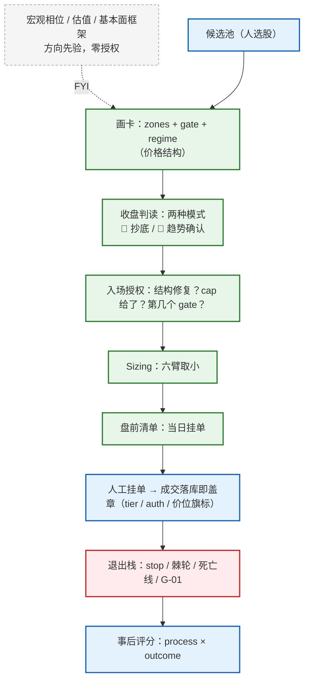

---
tags:
  - trading
  - system
  - hub
aliases:
  - System Overview
  - 系统总览
  - 当前交易系统
---

# 当前交易系统总览（2026-09）

> ⚓ **宁可错过，不可失序；失去节奏，终会成为市场的猎物。**
> 整套系统的第零条。错过一笔的代价有上限，失序的代价没有。

这一页是 `us-stocks/` 的地图：它不重复细则，只回答「现在这套系统长什么样、每一层管什么、细则住在哪」。细则一律以链接指向的 canonical 为准；**后裁决优先**，每条规则何时、为何被采纳见 [[#演进时间线]] 与 `strategy/directives/`。

> [!info] 阅读说明
> 这是一个人的真实交易系统的脱敏镜像：美股正股 + 单腿 long call，零杠杆。`STOCK_*` 是占位符；文中 `quant/...` 之类的名字指作者私有仓里的代码强制点——本系统的约定是**「规则不进代码 = 不存在」**：会驱动动作的约束必须有结构化字段 + 代码强制点，不能只活在散文里。

---

## 1. 分工四格：人做什么，系统做什么

| 环节 | 归谁 | 含义 |
|---|---|---|
| **选股** | 人 | 候选池 = 券商 App 里的一个自选分组；人的 edge 在这里 |
| **入场** | 系统 + AI agent | 每天盘前简报给出「当日挂单清单」，agent 排序与取舍；清单外 BUY 先过一轮机械检查，偏离 = 规则外 |
| **退出** | 系统的钟 | 止损 / 棘轮 / 趋势死亡线 / G-01 机械触发，当日执行，**没有 override** |
| **执行** | 永远人手 | agent 从不下单；挂单、撤单都是人工 |

源头：[[2026-08-18-entry-delegation-directive]]（「只有选股侧我是 edge，入场侧交给系统」）、[[trend-exit-system]] §6.1（2026-08-22 override 整条废止）。

## 2. 决策栈（从上到下，越往下越机械）



| 层 | 管什么 | canonical |
|---|---|---|
| 决策哲学 | 概率优先：后验 + EV，六铁律；process > outcome | [[bayesian-decision-model]]、[[post-trade-scoring]] |
| 授权（技术面优先 v3） | 入场授权 = **纯价格结构**；财报、thesis、研报、宏观一律 [FYI] | [[2026-08-04-technical-first-directive]] |
| 结构卡片 | zones、gate、regime、staleness | [[zone-maintenance]]、[[zone-touch-confirmation]] |
| 入场模式 | 只做两种：抄底 / 趋势确认 | [[2026-09-12-two-mode-directive]] |
| Sizing | cap 二值 + gate 风险预算 + 组合层六臂 | [[position-tiers]]、[[kelly-position-sizing]]、[[risk-capital-framework]] |
| 期权 | 单腿 long call；IV 门、保费上限、z1 回踩锚 | [[2026-09-02-long-call-entry-directive]]、[[leaps-call-template]]、[[options-strategy-framework]] |
| 退出 | 机械退出栈，宏观不豁免，无 override | [[trend-exit-system]]、[[greeks-discipline]] |
| 行为触发 | 三问快检 + 行为模式检测 + 硬拦话术 | [[trading-discipline]]、[[trading-rules]] |
| 研究 | 改会动钱的参数前先跑预注册回测 | [[research-verdicts]] |

## 3. 卡片：一张图就是一个状态机

每只候选 / 持仓一张「卡」，全部由价格结构画出：

- **仓位层线位**：`z1` / `z2`（加仓带）、`trim`（减仓许可区，不是指令）、`no_chase`（不追价上限）、`stop`（×N 日收盘确认）。
- **`current_regime.cap_pct_nav`**：「现在能不能参与」。**二值 {0, 40% NAV}**——0 = VETO（结构未修复 / 降级 / 持仓锁），40% = 单票名义天花板（是天花板不是额度）。
- **`next_regime.entry_gate`**：「下一个状态在哪」。每张卡都必须有；没有 gate = 这张图还没读完。
- **gate 是被发现的，不是被指定的**：市场反复在那个价上做过决定的地方（pivot 簇、供给簇、HVN/LVN 边界、旧 ATH、破位起点），多维收敛才算硬。
- **转移确认**：收盘站上 gate ×2 日 + 相对量比 **RelVR ≥ 1.1**（个股量比 ÷ max(基准量比, 0.4)；阈值 1.2 → 1.1 见 [[research-verdicts]]）。转移后地板 = gate − 0.5×ATR20。
- **Staleness**：过期、突破 trim、收盘破 z2 下沿、单日 >2×ATR14 异动、自家财报 → 先重画再判断，**禁止用 stale 卡硬拦交易**。破 z2 下沿当日另有盘中 BUY 冻结。

## 4. 两种入场模式（2026-09-12 起试行）

> 「目前的系统应该仅聚焦某种形态结构，做两种固定的模式……其他模式坚决不做。」——用户，2026-09-12

| | 🔁 抄底（空头衰竭） | 🚀 趋势确认（gate 转移） |
|---|---|---|
| 前提 | **该标的空仓**（持仓票不走抄底，加仓归 cap + Iron Rule #2 v2） | 卡上 gate 被收盘 ×2 + 量腿确认 |
| 信号 | 止跌低之后**次日未新低**，或止跌日**长下影**；且从 20 日顶跌下来 ≥2×ATR20、止跌低距 60 日高 ≥10% | gate 转移 → regime cap 授予 40% |
| 有效期 | 未收破止跌低 ∧ 收盘 ≤ 止跌低 + 2×ATR20 ∧ 信号 <10 根；离底太远 = 只播不开；失效 = 错过不追 | 在 z1 / z2 带内按阶梯挂单，超 `no_chase` 不追 |
| 止损 | **止跌低（下影线低点）收盘 ×1**，无期权 S1 | 卡片 stop / 转移地板；期权 = 授予 cap 的 gate ×1 日 + S1 −20% |
| 仓位 | 正股 = min(组合六臂, 2.5% NAV ÷ 止损距)；call = 2.5% NAV ÷ 止跌低处保费投影亏损，且须过 IV 分位门 | gate1 / gate2 / gate3 累计风险预算 2.5% / 4% / 5% NAV |
| 判读 | 附 [FYI]「底部确认概率」= 零参数随机游走的位置几何；判读不授权、不排序 | 附 gate 阶梯接近度 |

试行合同：≥10 笔或 60 个交易日先到即复核；止损率 >50% 或平均 R <0 → 回旧口径重议。卖 put / sell premium、「常规参与」等其他入场方式在同一天退役。

## 5. Sizing：六臂取小

```
实际可下 = min( regime cap − 当前敞口,
               gate 预算（2.5% / 4% / 5% NAV risk，累计）÷ 真 stop 距离 − 当前敞口,
               at-risk 5% NAV ÷ stop 距离,
               剩余冲击预算（15% NAV 单日损失）÷ (1.88 × ATR20 / 价),
               组合 gross 110% NAV − 已用 gross,
               购买力余额 )
```

- **真 stop** = 卡片 stop / 棘轮地板 / 趋势死亡线取 max；哪一臂在收紧（binding）必须播报。
- **整股约束**：`floor(cap / 价)` ≥3 股 → 三档 50/30/20；2 → 1+1；1 → 单档；0 → 买 1 股须书面例外。
- **期权**：保费上限按本档**新增** risk ÷ 0.20 → gate1 12.5% / gate2 7.5% / gate3 5% NAV；须过 IV 硬门槛（IV 分位 <40，序列不足用 HV20 分位代理）；**禁止降 delta 装 cap**；NAV 装不下一张 = 0 张 = 正股或 veto。
- **财报反应日 T+0** 是唯一的 sizing 例外（名义 cap 缩仓，T+1 恢复）。
- **熔断**：受管组合单日损失 ≥ 22.5% NAV → 清仓。

## 6. 退出栈：系统的钟

| 条款 | 触发 | 动作 |
|---|---|---|
| 卡片 stop | 按 `stop_level_days` 收盘确认破位 | **当日清仓**（盘后可成交即当晚） |
| 利润棘轮 | 峰值浮盈 ≥+50% → 地板 = 保本；≥+100% → 回吐上限 1/3 | 破地板两段式软着陆 + no-add lock |
| 趋势死亡线 | 收盘 < 最高收盘 − 3×ATR20（parabolic：5 日高 × 0.92） | 平剩余 / 至少减至 base |
| G-01 阶梯（期权） | mark 过 +100/+200/+300% | trim 30/30/40，只减不清 |
| 期权 gate 线 / S1 | 正股收盘破授予 cap 的 gate；保费 −20% | 清仓 |

**没有 override**：唯一合法的「不卖」是告警判据本身未成立，不是理由更好。未执行 = 规则外、评 C 起步、逐日点名。案例见 [[2026-08-22-stop-override-retirement-review]]。

## 7. 纪律层：在诱惑时刻起作用的东西

- **第零问**：这笔在不在今天的节奏里？清单外 / 止损后回补 / 改限价 / 盘中临时起意 = 答案已是「错过」。
- **三问快检**：① 授权状态（结构修复？cap？第几个 gate？）② 错了怎么认（具体止损）③ 位置（z1 / z2 / 等待区 / 追价 / trim 区）。三问都过 → 「检查通过，执行吧」，不制造摩擦。
- **行为模式检测**：改限价（perfect-price trap）、低于昨日低点挂单（greedy-bid）、FOMO、报复性交易、reactive 加仓 / 对冲、破 stop 后心存侥幸、开盘 30 分钟、期权追高（`above_z1`）、抄底过期追单。
- **落库即盖章**：每笔成交写入事件流时机械盖上档位、授权、价位旗标；规则外成交才需要人工注解与评分。
- **评分矩阵**：process 对 = A（结果好坏皆 A）；process 错 + 结果好 = **D**（最危险）；process 错 + 结果坏 = C。

## 8. 判断层：有价值，但零授权

这些东西会出现在简报和卡片上，但**不改 cap、不改股数、不改退出线**：

- **宏观相位**：只作方向先验与风险环境；不翻译成 GO / VETO / 仓位。方法见 [[macro-inference-contract]]、[[macro-sensor-map]]、[[rate-to-equity-transmission-framework]]、[[market-structure-analysis]]。
- **估值与基本面框架**：DCF + EPS×PE 交叉，周期股看反向隐含；卡片上的 thesis 用「假设 → 驱动 → 空头与证伪 → 催化剂预注册」写，不写评级和目标价。见 [[fundamental-frame]]。
- **大盘状态卡**（震荡 / 单边 / 转换中）、**箱体 ⭐ 线位**、**dealer gamma**、**底部确认概率**：描述性标注。它们各自的样本外检验见 [[research-verdicts]]——多数「看起来有用」的维度在控制位置之后没有增量。

## 9. 每日节奏（全部自动化，美东时间）

| 时点 | 任务 | 产出 |
|---|---|---|
| 开盘前 | 盘前简报 | 持仓状态、开盘操作手册、**当日挂单清单** |
| 盘中 / 盘后多次 | 巡逻 | 退出栈与异动告警原文推送 |
| 收盘后约 10 分钟 | 收盘转移 | 卡片状态机转移、受控重画、入场计划按收盘重锚 |
| 收盘后约 20 分钟 | gate 阶梯表 | 转移后世界的每张卡离 gate 多远 |
| 收盘后约 35 分钟 | 收盘判读 | 大盘状态卡 + 两种模式「已形成 / 即将形成」清单 |
| 每周 | 周复盘 | 宏观 / 技术 / 风控复核，所有持仓 zone 强制 review |

所有交易任务先经交易日历判定：休市或未到点直接跳过；半日市与夏令时由同一个判定器裁决。

## 演进时间线

| 日期 | 事件 | 结果 |
|---|---|---|
| 2026-03 → 04 | 早期规则 #1–#39（FOMO、perfect-price trap、催化剂 ≠ 确认） | [[trading-rules]] 与 3–4 月复盘 |
| 2026-06-04 → 06-11 | Bayesian 决策层、分数凯利、内生市场论、全框架重组 | master index 建立 |
| 2026-07-04 | 赢家侧退出栈（棘轮 + 趋势死亡线） | [[trend-exit-system]] |
| 2026-07-15 | 半年复盘：执行缺口 + 心态×结构错配 | [[mindset-structure-pairing]] |
| 2026-07-17 | 退出规则全样本反事实回测；入场守卫上线 | 出场参数局部最优，唯一杠杆 = 执行率 |
| 2026-08-04 | 技术面优先 v3：授权只看价格结构 | [[2026-08-04-technical-first-directive]] |
| 2026-08-13 | 分类轴退役：cap 二值 {0, 40%} + gate 风险预算 | [[position-tiers]] |
| 2026-08-18 | 入场委托：人选股、系统出清单、人执行 | [[2026-08-18-entry-delegation-directive]] |
| 2026-08-22 | 退出 override 整条废止 | [[2026-08-22-stop-override-retirement-review]] |
| 2026-08-31 | 情报层收拢；宏观相位作先验 | [[2026-08-31-intel-consolidation-directive]] |
| 2026-09-02 / 09-08 | long call 从 gate1 起 + IV 门；期权限价锚 z1 回踩，追高盖章 | [[2026-09-02-long-call-entry-directive]] |
| 2026-09-09 | 量腿阈值 1.2 → 1.1（首次被测，无膝点） | [[research-verdicts]] |
| 2026-09-12 | 两种模式：只做抄底与趋势确认 | [[2026-09-12-two-mode-directive]] |
| 2026-09-14 → 09-24 | 抄底有效期换口径；底部确认概率；一段下跌门；箱体 ⭐ 样本外 REJECT | [[research-verdicts]] |

## 新读者的阅读顺序

1. 本页 → [[trading-rules]] 顶部 master index
2. [[2026-09-12-two-mode-directive]]（现在做什么）→ [[position-tiers]]（能下多少）→ [[trend-exit-system]]（怎么退出）
3. [[trading-discipline]]（诱惑时刻怎么拦）→ [[post-trade-scoring]]（怎么打分）
4. [[research-verdicts]]（哪些直觉被数据否掉了）
5. `reviews/`（每条规则背后的真实代价）

---
> 📍 **Navigation**
> 上级：[[us-stocks/Home|US Stocks Hub]]
> 相关：[[trading-rules|Trading Rules]]、[[research-verdicts|研究裁决账本]]、[[Investment_First_Principles|投资第一性原理]]
